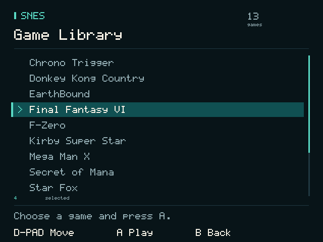

# DIIUM D-R35: device findings and SNES platform

Source, hardware investigation and a working SNES-only launcher/runtime prototype for one tested D-R35. This device runs **embedded Linux on a single Cortex-A7**, with limited RAM and vendor display/scaler interfaces. It is not an Android/RetroArch port.

The project replaces the launcher/runtime in userspace while retaining the working kernel and display driver. It also preserves the earlier SNES Plus adapter and diagnostic tools, so successful work and failed hypotheses remain reproducible.

## Current status — 2026-10-10

- **A7 cost1 returned, unarmed:**13 physical passes reproduce the PCM stop before dense frame320. Partial warm setup credit0.231ms minus extra rows0.150ms and short helpers0.115ms predicts a0.033ms loss, far below the1.514ms saving needed. Deep phase clocks materially perturb the test; full candidate cache/span coverage remains incomplete. Archive, clean FAT and141 protected hashes verify with0 card writes. No new build/install. [Measured costs and prediction](docs/snes-a7-cost-return.md).

- **ROM-derived Bio Blast investigation:** the3 MiB ROM rebuilds byte for byte, with103,538 native instruction addresses mapped into private C and a readable script/wave model.178 actual wave-kernel calls match that model. Circular-window edge writes, rather than scroll writes, repeatedly flush the renderer. A separate scanline-window patch passes524,288 clip states and3,600 comparison frames; effect PPU updates fall78.97%, but color preparation rises34.58%. No physical speedup/audio fix is claimed and this candidate is not installed. [Cause, code and tests](docs/ff6-bio-blast-cause-map.md).

- **Focus1 returned and unarmed:** Bio Blast still fails on the unchanged1.19 core. Sampled PPU CPU rises5.741 ->8.904ms; APU-inclusive stays4.529..4.898ms. The core's clock model predicts735.948 sink frames/call; late physical production is38,481/sec against44,100Hz.60 runtime/progress and49 lab files are archived with clean FAT and unchanged private progress. Complete effect/recovery reserve and candidate unit costs remain unmeasured; the window candidate fails the written prediction gate. [Effect budget and scorecard](docs/snes-focus-1-return.md), [exact resume](docs/handoff-2026-10-10.md).

- **Both Vesper boot screens installed and verified:** user confirms Vesper static -> Vesper animation -> stock launcher. Both complete 8 MiB flash reads match the expected image byte for byte. Original SD startup restored; firmware update trigger absent, stock/progress hashes preserved, FAT clean. Cost1 has returned; all tests are unarmed. External recovery unqualified; audio unresolved. [Verified result](docs/vesper-static-firmware-update.md).

- **Previous second-animation baseline verified:** before the first-screen update, both complete 8 MiB reads matched the expected programmed image byte-for-byte after removing Code.bkp. Normal SD init was restored, stock/progress hashes were preserved and FAT was clean. This is the verified baseline for the current replacement. [Previous verified return](docs/vesper-flash-verification.md), [accepted animation update](docs/vesper-sd-firmware-update.md), [current handoff](docs/handoff-2026-10-09.md).

- **MVP1.18 audio failure remains unresolved; FAT recovery completed:** approved repair preserves14 lost chains and all412 previously readable files. Missing1.18 session/PCM reports are recovered; verified pre-test SRAM replaces the empty current file. Fresh health and strict archive checks pass; exact release/stock/snapshots survive, both tests unarmed. [Recovery and current resume](docs/fat-recovery-2026-10-09.md).
- **Vesper artwork and earlier SD-stage test:** cyan feathered wing-V/heart on black with18-frame loading dots. The earlier one-shot displayed after both stock screens and remains consumed/unarmed. The subsequent internal updates above now replace both original boot screens. [Artwork and earlier receipt](docs/vesper-boot.md).
- **MVP1.17 first launch succeeded:**35,763 calls at59.978/sec overall, zero held drawings/duplicate callbacks, snapshot load worked. Terra's Magitek armor Bio Blast ended with an audio error/our library after a transient renderer/production deficit. First-launch isolation worked in this run; repeated cold-boot reliability is not established. User withdrew expected driving snow after checking playthroughs. [Return](docs/snes-mvp-1.17-return.md), [diagnostic isolation](docs/snes-mvp-1.17.md).
- **MVP1.16 returned very playable:** successful retry sustained31,601 calls at59.985/sec, combat/party menu/game save/snapshot load worked. Its first launch failed during live wrapper diagnostic activity, removed in1.17. [Return](docs/snes-mvp-1.16-return.md), [renderer repair](docs/snes-mvp-1.16.md).
- **MVP1.15 returned with audio failures:** both retained snapshot loads succeed, then19/18 calls exhaust production margin. Ordinary expensive-scene main CPU is about18ms, wall19.3–19.5ms; sampled PPU about10ms. Exact payload and21 game-progress files match; no new whole-device poweroff established. First-attempt detailed history was overwritten by retries. [Return](docs/snes-mvp-1.15-return.md), [raster census](evidence/2026-10-06/raster-work-census/analysis.json).
- **MVP1.13 return established sustained underproduction:** 26/230 calls, successful snapshot on retry, exact payload and all 20 private progress files unchanged. Fault history and kernel READ_ALL survive. The retained expensive phase produces about 37k accepted frames/sec against a negotiated 44.1k sink, before three 128-frame application-pointer advances and SETUP. Starvation is the leading trigger; exact vendor stop behavior remains unresolved. [Return](docs/snes-mvp-1.13-return.md), [budget review](docs/execution-budget-review.md).
- **Hardware confirmed:** MVP 1.5 boots into its library, starts Final Fantasy VI and loads the imported save state. All four directions work in the launcher and game.
- **Returned MVP 1.5:** 23,872 core calls, 2,826 held drawings (11.838%), no reported audio-write errors. The user heard rare random crackles in normal play and occasional lag. Full rendering and uninterrupted playback remain the target.
- **MVP1.6 failed its physical run:** very choppy sound, slow movement, clean-looking graphics, then the whole device powered off. The returned build hashes match; originals are intact and the one-shot is consumed. No fresh session totals survived. Do not re-arm this release unchanged. [Failure review](docs/snes-mvp-1.6-failure.md).
- **MVP1.7 returned without a crash:** reached a Save Point, saved and exited normally, but remained laggy; FF6's party menu helped partially. Fresh counters show 7,068 calls, zero holds, about 54.63 emulation calls/sec of active-loop time and 31.08% of calls definitely over budget. That return was archived read-only before updating; new SRAM is preserved. Missing `head` left diagnostic gaps, corrected and tested for1.8. [Return review](docs/snes-mvp-1.7-return.md).
- **MVP1.8 returned with clicking and whole-device power-off:** fresh checkpoint records1,648 calls, zero held drawings and about57.93 calls/sec of active-loop time. Saved progress and stock/hook hashes were intact and the returned card was unarmed. Shutdown cause remains unknown. Firmware also lacks `sed`; the capture fix passes without `head` or `sed` and is incorporated in1.9. The exact returned core passes10,000 output-equivalence frames. [Return review](docs/snes-mvp-1.8-return.md), [implementation](docs/snes-mvp-1.8.md).
- **Working reference:** v11 SNES Plus adapter in the vendor launcher. Intro/Narshe/wind listening tests were clean with adaptive internal drawing suppression.
- **Not established:** cold first-launch reliability, every scene's full speed/effect fidelity, independent panel scanout cadence, a controlled speed comparison with v11, broad emulator compatibility, usable hardware GPU acceleration, or factory-card compatibility of the current installer.
- **Hardware lab1 returned successfully:** stock launcher resumed; all four display phases complete240/240 jobs, including a12ms CPU load, while audio remains buffered in samples. NEON wins the tile fixture; the experimental color cache loses.5ms deadlines average5.48ms late, making timer-polled pacing a concrete next target. Text readability and transition clicks are recorded. Its return was archived and its one-shot consumed. [Physical findings](docs/platform-lab-1-return.md), [scope](docs/platform-lab.md).
- **Lab2 returned complete, with clicks:** all nine PCM byte targets and all four 240-drawing phases complete, but the user hears clicks between and during tests. All short timeout methods average about 10ms despite timer-slack reduction; audio readiness wakes around 2.77ms in the smallest-fragment transport. Burst production exceeds the available playable reserve. All 973 scaler statuses contain FRAME_DONE; the ten-sleep fallback never runs. Archive verifies 41 MVP/49 lab files and 20 protected private entries. Card unarmed, zero writes. [Physical findings](docs/platform-lab-2-return.md).
- **Source research leads1.9:** Linux 4.19 OSS source exposes partial-fragment staging and explains why POST/zero-delay/RESET does not qualify complete tail playback. Native ALSA defines negotiation, priming, device-driven refill, stream-state observation and drain; its playback node exists on this device. That contract is now implemented with one coherent PCM owner. Exact vendor behavior and full-speed FF6 remain unqualified. [Interface research](docs/platform-interface-research.md).

## Start here

| Topic | Document |
|---|---|
| Broad passive inventory and active test catalog | [Device survey suite](docs/device-survey.md) |
| Hardware, OS, memory, clocks, display, audio, UART | [Device findings](docs/device-findings.md) |
| Splash handoff, GPIO map, clocks, ABI and lifecycle | [Boot and hardware contracts](docs/boot-and-hardware-contracts.md) |
| Source, dependencies, checks, installation and recovery | [Build and test](docs/build-and-test.md) |
| What each investigation proved or ruled out | [Investigation history](docs/investigation-history.md) |
| Runtime ownership and next engineering work | [Architecture](docs/architecture.md) |
| Current A7 core/runtime build and physical acceptance | [Focus1 diagnostic](docs/snes-focus-1.md), [MVP1.19 return](docs/snes-mvp-1.19-return.md), [ROM-derived window experiment](docs/ff6-bio-blast-cause-map.md) |
| Hardware resources, measured costs and remaining opportunities | [Capability roadmap](docs/hardware-capability-roadmap.md) |
| Latest infrastructure result and researched audio contracts | [Lab2 return](docs/platform-lab-2-return.md), [interface research](docs/platform-interface-research.md) |
| Concrete Cortex-A7 core and pipeline proposal | [Full-speed SNES plan](docs/full-speed-snes-plan.md) |
| Forward A7 renderer implementation | [MVP1.8](docs/snes-mvp-1.8.md) |
| Latest gameplay and remaining failure/effect limits | [MVP1.19 return](docs/snes-mvp-1.19-return.md) |
| Current failure model and proposed engineering direction | [Execution-budget review](docs/execution-budget-review.md) |
| Logging retry implementation | [MVP1.7](docs/snes-mvp-1.7.md) |
| A7 full-render implementation and failed test | [MVP1.6](docs/snes-mvp-1.6.md), [failure review](docs/snes-mvp-1.6-failure.md) |
| Actual shipped emulator identities and limitations | [Core inventory](docs/core-inventory.md) |
| Evidence preservation and future changes | [Maintenance](docs/maintenance.md) |

The particularly expensive discoveries are written down explicitly: **finish the vendor splash handoff before opening a display; compare libc clocks with direct kernel clocks; translate GPIO through the stock input callback's mask table; retain DMA buffer ownership until completion.**

Rendered UI preview; this is not a handheld photograph.

## Repository layout

- `build/snes-mvp/`: launcher, runner, UI, board backend, timing, state importer and checks.
- `build/`: current and historical adapter/probe source, analyzers, builders and guarded installers. Historical installers are not generic deployment tools.
- `evidence/`: selected returned logs, analysis, recovered ABI data and verification, with a provenance/hash manifest.
- `docs/reference/`: dated deeper hardware/runtime/core reviews. These are proposals or historical reviews where marked; current corrections in the guides take precedence.
- `releases/`: owned versioned ARM executables, wrappers and verification. Games, private saves, vendor driver/core/runtime libraries and full firmware backups are not included.

Only one hardware unit has been tested. Confirm the identity and software hashes of another unit before applying recovered private ABIs. A filename or identical product label does not establish matching firmware.

## Contributing

Preserve the known working path, make bounded changes, record physical results separately from QEMU checks, and update the relevant guide and changelog in the same commit as the fix. See [maintenance](docs/maintenance.md). Code and dependencies retain their own notices; see [NOTICE](NOTICE.md).
