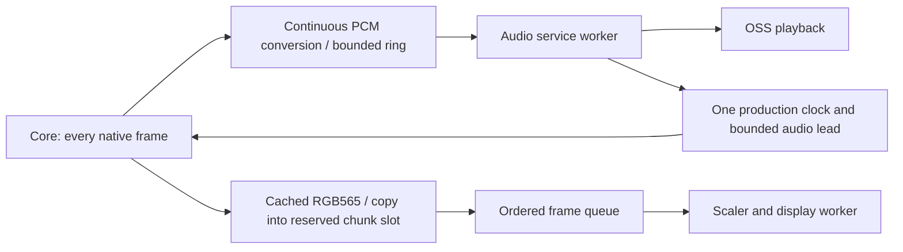

# Proposed full-speed SNES runtime

2026-10-04. Proposal only: no new device run, executable replacement or re-arm.
Target the current FF6 workload first, preserving Plus/Blargg sound and complete
rendering. Native NTSC cadence here is 59.922743404 emulated frames/s, with a
16.6881545 ms period. “60 FPS” means that native speed, not a forced 60.000 clock.
Other games and enhancement chips need separate qualification.

## Evidence and confidence

MVP1.5 returned 23,872 steps, 2,826 held drawings (11.838%), and 21,046 submitted
images. All four directions are physically confirmed. The user heard rare random
crackles during the opening story and map, and some lag. These are physical
observations, not assigned causes.

Core-call mean wall time was 14.591 ms and measured thread CPU 13.230 ms, with
automatic holding enabled. The histogram places p95 in [19,20) ms and p99 in
[21,22) ms; maximum was 40.844 ms. At least 4,905 calls (20.547%) exceeded the
16.688 ms period; 5,078 calls in [16,17) ms cannot be classified precisely.
These durations include callbacks. The mixed average cannot establish the cost
of full rendering, actual game speed or total CPU utilization.

Video submissions averaged 1.893 ms wall time each and reached 19.713 ms. That
includes packing/copying, synchronization and waiting, not isolated scaler CPU.
Audio callbacks averaged 0.165 ms per core step. Zero write errors were recorded;
the software ring peaked at 2,795/8,192 frames, not capacity. Sampled device
queue depth was 1,024–2,048 frames (23.22–46.44 ms). Sampling once per 60 steps
cannot see a brief empty queue. Playback underruns and actual panel presents
were unavailable. Opening/resume/exit resets prevent aggregate acceptance
counters alone from proving lossless playback across the entire session.

Concrete code evidence:

- MVP board worker clears `busy` only after DrawVFB **and** FlipVFB. Its producer
  waits for this flag inside the video callback. The stock worker releases the
  source after DrawVFB and before FlipVFB.
- Pinned Plus `retro_run()` calls S9xMainLoop, then video_cb, then
  audio_upload_samples. A delayed video callback therefore delays sound delivery.
- The runner polls GPIO before the core; the core's input callback polls again.
- The retained draw controller targets 92% of the frame budget and can hold up
  to half the drawings. It is an inherited workaround, not the acceptance goal.
- Plus is already compiled for Cortex-A7/NEON, but the Unix recipe is O2 with
  fno-builtin, and the inspected tile/color paths are scalar. CPU targeting is
  not equivalent to a SIMD renderer.

Older v9 full-render calls averaged 19.958 ms, versus 6.752 ms with internal
drawing disabled. That workload requires removing at least 3.270 ms of elapsed
work/waits merely to fit its period. It does not isolate PPU CPU, and must not
be added to the newer run as if both were the same experiment.

## Chosen design

Keep the existing UI, boot handoff, kernel-clock repair, input map, vendor kernel,
Plus emulation and Blargg sound engine. Change the runtime hot path and selected
core rendering functions. Full rendering and all PCM are mandatory; overload
must be reported, never converted silently into a frame-holding success.

### 1. Remove scanout waits from the core callback

Reserve a FREE source slot before entering the core. Render into normal cached
memory; the video callback performs one compact copy into that reserved chunk
slot and publishes an immutable job. It performs no FlipVFB or previous-frame
condition wait. Allocate three source slots: at most one SCALER_READING, one
READY, and one reserved/FILLING. This is an ordered bounded queue; do not replace
or discard a READY image. If no slot is available, wait outside retro_run with
audio service still active and record congestion.

The worker releases the **source** after the recovered scaling-completion
boundary, before waiting on display scanout. It remains the sole caller of
DrawVFB/FlipVFB. Source release and scanout/output release are distinct; never
render into or flip an output buffer still owned by display hardware. Join and
drain the owned worker before pause UI, geometry transition or teardown. Retain
the validated compact copy: drawing the SNES into uncached chunk memory is not
an assumed speed win.

### 2. Stop making sound wait behind video

In the pinned Plus wrapper, publish completed audio after S9xMainLoop and before
the video callback. This changes delivery order, not SPC/DSP emulation or PCM.
Verify identical samples, pixels and game state against the baseline.

Audio callbacks retain the continuous converter and enqueue PCM only. One small
audio worker owns OSS writes, device queue observations and accepted-byte/tail
accounting. It waits for actual writable/data events, preserves partial/EAGAIN
data, and feeds previously generated PCM while the core is in device waits or
being scheduled. It does not spin on EAGAIN or hold a core/display lock across
I/O. Start with ordinary scheduling; a thread supplies service independence,
not additional CPU capacity. Pause/load/reset use an acknowledged epoch/reset
transaction; an old worker cannot write old PCM after a new stream is primed.

Use one controller for emulation pace. Its long-term reference is validated
audio consumption; direct kernel monotonic time interpolates/coarsely schedules
wakes. Total queued PCM means software plus device, not a separately filled
target for each. Initial total target about 50–60 ms, with a 70 ms design ceiling;
reduce after stability is proven. Use a verified playback cursor if available;
GETOPTR/GETODELAY precision and resets must be qualified. If unreliable, retain
kernel-monotonic production with one slow bounded resampler drift correction,
not a second controller also adjusting game speed. Unsupported cursor/poll
behavior is a visible backend limitation, not an invented audio clock.

Retain 44.1 kHz stereo S16 and Blargg's native stream initially. Do not assume
the DAC accepts 32,040 Hz, or make an ALSA migration a prerequisite. Linux4.19
OSS can hide EPIPE as zero delay, so successful writes cannot certify zero
underruns. Record service gaps and queue minima; label inferred starvation and
true backend XRUN counters separately.

### 3. Earn CPU headroom in the same Plus core

A host-only rewrite is not a sufficient promise. The first core change is a
Cortex-A7 renderer specialized for ordinary 8-pixel tile rows and RGB565 color
math. The existing tile cache already supplies eight decoded palette indices;
the scalar path handles two groups of four pixels, with dependent palette loads,
transparency/depth branches, and per-pixel color-math selection. Its explicit
assembly specialization is MIPS, not this board's ARM path.

**Use register-resident palettes, not a nonexistent memory gather.** A 4bpp tile
uses 16 RGB565 colors: 32 bytes, fitting four 64-bit D registers. Load that table
once per tile drawing call. Two ARMv7 `VTBL` lookups at byte indices `2*p` and
`2*p+1`, followed by `VZIP`, assemble eight 16-bit colors. The 2bpp variant needs
only an eight-byte table; never read 32 bytes beyond a four-color palette.
Keep 8bpp/direct-color paths scalar initially, because their tables do not fit
this trick. Respect palette/brightness changes at every call; any later palette
cache requires the core's correct invalidation rules.

Load eight indices/depth values with `VLD1`. `VCEQ`/`VCGT` build transparency and
priority masks; expand to full 16-bit masks, then `VBSL` merges selected colors
and new depth with existing pixels/depth. `VREV64` reverses the eight index bytes
for horizontal flipping. This replaces repeated branches and dependent loads;
it is not a claim of eightfold speed. Keep clipped/unusual-width paths scalar
until their safe load/store bounds are separately implemented.

For add/subtract/half-color, operate on the individual SNES channels with shifts,
masks, adds/subtracts and channel clamps. Packed-word `VQADD.u16` is wrong: whole
16-bit saturation is not RGB channel saturation. Match every existing rounding,
borrow, clipping/window, fixed-color/subscreen and green-bit rule. The scalar
half-subtract path uses the 65,536-entry `GFX.ZERO` table (128 KiB); exact vector
arithmetic can remove those indexed accesses, but current data does not measure
their cache-miss cost. Optimize full backdrop/color spans too, not only tiles.
Mode7 and uncommon modes retain the reference path initially.

If the target's expensive scenes use Mode7, a separate candidate batches its
incremental fixed-point coordinates in 32-bit NEON lanes and reuses the exact
vector depth/color kernels. Tile-map and 256-color palette accesses still need
scalar gathers or a qualified cache strategy; NEON does not make those free.
Retain repeat/out-of-bounds, EXTBG priority and interpolation semantics. The
first tile optimization must not be treated as proof of full-speed Mode7.

Cortex-A7 is in-order. Schedule independent loads/arithmetic, keep the palette
live across tile rows, and inspect generated code for register spills. Bounded
alignment and `PLD` prefetch candidates must earn a measured improvement; blindly
prefetching more data can waste bandwidth. The local 2010 SIMD color kernels are
reference material, not a wholesale core switch or drop-in compatible renderer.
Exhaustive color-kernel checks and differential rendered-frame/depth comparisons
must precede claiming equivalence. A 25–35% rendering-CPU reduction is an
engineering objective, not a speedup inferred from the instruction names.

Build qualified O2/O3/LTO variants and allow optimized builtins for audited
copy/clear sites. Choose by Cortex results, not QEMU wall time or flag labels.
Preserve overflow/aliasing assumptions; no fast-math or emulated overclock. Keep
Blargg behavior unchanged. Preallocate bounded hot-path buffers and poll one GPIO snapshot
per core frame rather than performing the same reads twice.

Design allocations, **not measured costs or predicted savings**:

| Work on the single CPU | Target per native frame |
|---|---:|
| Full core CPU/PPU/APU, excluding host callbacks | <=12.5 ms |
| Input, conversion, compact copy and queue bookkeeping | <=0.5 ms |
| Audio/display workers combined CPU | <=1.5 ms |
| Remaining allowance for kernel/preemption/jitter | ~2.19 ms |

Peripheral waits may overlap core work, but worker CPU must be charged to this
same CPU. Bounded queues absorb occasional slow frames; they cannot absorb a
sustained deficit. If Plus still exceeds capacity, further renderer/CPU work is
required before declaring full-speed support. Switching to less accurate sound
is not the default solution.

### 4. Give the scaler a persistent backend if its lifecycle constrains throughput

Per-job open/configure/start/status/stop/close is recovered from the real driver.
More surprisingly, its not-done path sleeps ten times for 1 ms without rechecking
status. That is a concrete opportunity for avoidable tail delay; it is not proof
that this path caused the observed 40 ms core call.

The second backend owns one scaler fd for the gameplay session, caches stable
geometry, and uses the recovered setup/trigger/wait/status operations with a
bounded completion loop. Retain required stop/reset operations until per-open
state and repeated-job semantics are qualified. Preserve vendor display
initialization, framebuffer acquisition and flipping initially. This avoids
rewriting every peripheral at once while allowing replacement of PScaleRun.
The known synchronous backend remains usable for the first ordered-queue version.
Do not enable A/B queue fields merely because DWARF names them: both buffer
ownership and actual driver queue behavior still need proof.

### 5. Larger core possibilities, with exactness preserved

Blargg's Gaussian interpolation shifts each product separately, wraps the first
three summed terms to int16, then adds/clamps the fourth. Echo FIR has its own
per-product truncation and intermediate wrapping. Replacing either with `SMLAD`
followed by one shift changes samples. Candidate `SSAT` clamps and parallel
`VMULL`/`VSHR`/`VADD` left/right work must retain those boundaries. The shipped
compiler already emits some NEON in DSP echo work; new assembly must improve on
that binary, not assume the entire APU is unoptimized. Keep echo/interpolation
and the accurate sound engine enabled.

If tile conversion itself becomes significant, compare a NEON bitplane unpack
against the existing indexed lookup converter. Already-converted tiles are
cached; speeding only cache misses may have little session-wide benefit.

A 65C816 ARM block translator is a larger option if opcode execution remains
the limiting CPU cost after rendering fixes. Stable ROM blocks can amortize
dispatch, but PPU/APU/DMA event boundaries, exact cycles, bank/mode changes and
RAM-code invalidation are mandatory. It is substantially more work than vector
tile kernels. The unrelated shipped PS1 recompiler is not a SNES drop-in.
The DT GPU node and Generalplus graphics names do not establish a usable SNES
GPU renderer. The scaler is already the established hardware acceleration path.

**Throttling is earned by excess throughput.** An uncapped, full-render core must
first sustain more than 59.923 frames/s without a growing peripheral queue. Then
the single pacing controller sleeps to match native time. Removing a clock wait
does not accelerate instructions or DMA. Record time ahead/behind and explicit
pacing waits so a mistaken brake is visible. Keep the direct-kernel-clock repair;
do not revive the broken libc absolute-deadline path.

## Implementation order and acceptance

Implement source-release/ordered queuing, audio-first delivery, independent PCM
service and single pacing ownership together; remove adaptive holding from the
full-render profile. Build renderer candidates and qualify equivalent output
locally before the next handheld run. Scaler lifecycle replacement is a bounded
extension, not a speculative dependency. UI behavior remains familiar.

The next device artifact must count native core steps, rendered frames, FIFO
submissions/scaler completions, held/superseded images, playable PCM produced,
accepted, remaining and deliberately cleared at transitions. Frame omissions
must remain zero; no silent fallback. Record both workers' CPU, queue backlog,
producer wait, scaler/flip durations, scheduler service gaps and audio position
quality in bounded memory; write after play, not per frame to SD.

Success: native game/audio speed over sustained windows; zero internal holds or
discarded ready images; ordered completion without growing backlog; full PCM
with no starvation/crackles; bounded latency rather than seconds of buffered
audio. A 50–60 ms audio target is buffering latency, not a measured end-to-end
latency claim. Measure display cadence separately: FlipVFB return is not proof
of an optical panel presentation, and panel refresh must support native cadence.
Natural repeats from 59.923-to-panel-clock mismatch are distinct from dropping
an emulated picture. No claim of all-game support from one FF6 run.

This is a credible engineering path, not a guarantee based on the current mixed
statistics. The display/audio coupling fixes are directly supported by code;
renderer speedup and sustained full-frame panel throughput require hardware
qualification. Do not reinstall the same renderer with holding disabled and
call that the proposed optimization.

## Sources

- [MVP board](../build/snes-mvp/board.c), [runner](../build/snes-mvp/runner.c),
  [budget policy](../build/render_budget_production.h).
- [Returned MVP1.5 session](../evidence/2026-10-04/snes-mvp-1.5/last-session.txt)
  and [analysis](../evidence/2026-10-04/snes-mvp-1.5/analysis.json).
- [Stock driver assembly](../evidence/2026-10-04/launcher-performance-review/annotated-paths.txt).
- Plus pinned a79dfe9047e7fec58808aefe48ad2bf499c7af11:
  [libretro.c](https://github.com/libretro/snes9x2005/blob/a79dfe9047e7fec58808aefe48ad2bf499c7af11/libretro.c),
  [tile.c](https://github.com/libretro/snes9x2005/blob/a79dfe9047e7fec58808aefe48ad2bf499c7af11/source/tile.c),
  [gfx.h](https://github.com/libretro/snes9x2005/blob/a79dfe9047e7fec58808aefe48ad2bf499c7af11/source/gfx.h),
  [gfx.c](https://github.com/libretro/snes9x2005/blob/a79dfe9047e7fec58808aefe48ad2bf499c7af11/source/gfx.c),
  [apu_blargg.c](https://github.com/libretro/snes9x2005/blob/a79dfe9047e7fec58808aefe48ad2bf499c7af11/source/apu_blargg.c)
  and [Makefile](https://github.com/libretro/snes9x2005/blob/a79dfe9047e7fec58808aefe48ad2bf499c7af11/Makefile).
- [Arm NEON programmer's guide](https://documentation-service.arm.com/static/63299276e68c6809a6b41308):
  Cortex-A7 characteristics and register table lookup.
- [Arm Advanced SIMD intrinsics](https://arm-software.github.io/acle/neon_intrinsics/advsimd.html):
  ARMv7 `vtbl4_u8`, `vrev64_u8`, `vbslq_u16` and related operations.
- [Arm ACLE DSP intrinsics](https://arm-software.github.io/acle/main/acle.html):
  saturation and packed multiply-accumulate semantics.
- [Linux4.19 OSS code](https://raw.githubusercontent.com/torvalds/linux/v4.19/sound/core/oss/pcm_oss.c),
  snd_pcm_oss_get_odelay / get_ptr / poll, and
  [OSS conversion documentation](https://www.kernel.org/doc/html/v4.19/sound/designs/oss-emulation.html).
