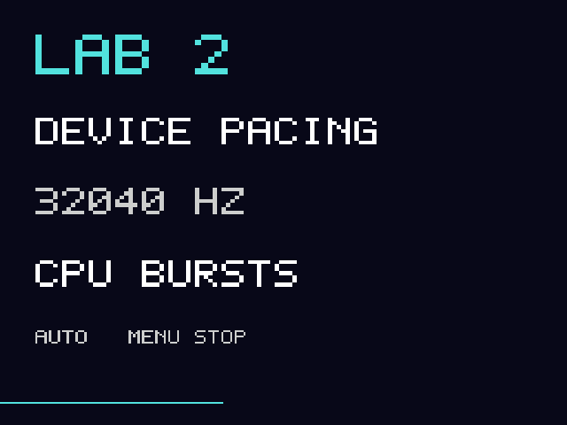

# Hardware lab2: infrastructure contracts — 2026-10-05

Ben authorizes aggressive infrastructure investigation and the next bounded
device test. Lab2 is a separate native executable. It preserves the game runner,
core, original wrapper, stock software and private progress. It does not run a
ROM. Its physical behavior remains unqualified until the returned logs and
user observations establish it. Host/QEMU success is never a speed claim.

## What this test decides

1. Which waits actually deliver useful wake precision on this kernel?
2. Do OSS readiness, accepted bytes, queued bytes and playback pointers form a
   coherent consumption contract, including reset and drain?
3. Does 32,040 Hz playback behave usefully, rather than merely negotiate?
4. Where does the vendor display/scaler path spend its time, and which buffer
   addresses, queue fields and status bits does it actually use?
5. Does direct chunk writing help a simple memory workload relative to heap
   writing plus copy? Cache policy and full renderer cost remain separate.
6. Can a single coherent audio owner pace every synthetic drawing through
   steady CPU load and occasional longer calls?

## Exact vendor calling contract recovered offline

[Extraction](../build/extract-lab2-driver.py) pins the original driver SHA256
`2c0134b3fc425f5b65c271c014e291824590c773190014f4e50c3ed33c2f13f9`, reads ELF
symbols/segments and DWARF, and disassembles named functions. Its local register
constant recovery is a review aid; instruction/control-flow inspection is the
authority. [Curated contract](../evidence/2026-10-05/lab2-driver-contract/contract.json)
and [disassembly](../evidence/2026-10-05/lab2-driver-contract/disassembly.txt)
contain no vendor runtime dependency.

`PScaleRun` opens `/dev/pscaler_a`, then performs this sequence:

| ioctl | Observed third argument | Recovered behavior / boundary |
|---|---|---|
| `0x5003` | No consumed argument | Pre-job command, repeated before close; stop semantics inferred from placement |
| `0x40e45000` | Pointer to 228-byte `gpPScalerPara_s` | Configuration object with input/output geometry and addresses |
| `0x80045001` | Scalar zero | Trigger candidate; exact kernel implementation unavailable |
| `0x80045004` | **Scalar 3000** | Wait candidate; units and kernel semantics unqualified |
| `0x80045005` | Pointer to stack status word | Reads status; caller tests **bit 2**, not equality with enum value 2 |
| `0x5003` | No consumed argument | Final command, then close |

The read-direction ioctl encoding of command4 does **not** establish a pointer
argument. The shipped call puts the integer3000 in r2. Its configuration size,
argument values and layout are recovered independently; do not invent an SDK
from ioctl encodings alone.

When status lacks FRAME_DONE bit2, the shipped function executes ten `usleep(1000)`
calls **without reading status again**. Lab2 prices the actual scalar command,
status result and following stop gap separately. Timer granularity could make
that fallback more expensive than the nominal ten milliseconds; physical logs
must establish whether it fires and what it costs.

DWARF also names BUF_A_DONE=4, BUF_B_DONE=8, OVERFLOW=128, INPUT_EMPTY=256,
AHB_DONE=512, FRAME_DONE_LAST=1024 and IDLE=8192. These are useful leads, not proof
that continuous A/B queueing works. Output addresses are at64/68, queue-enable
at72 and bypass-queue at84. Lab2 records the actual config fields before ioctl.

`dispFlip` selects one of two44-byte bitmap objects using its index at offset104,
issues `0x402c6413` with that bitmap pointer, then no-argument `0x6402` and `0x6407`,
and only then XORs the buffer index with1. The bitmap has width/height at0/2,
pitch at4 and data pointer at8. Alternating userspace buffers still do not prove
the kernel's precise scanout-release boundary or authorize overlapping scaler
operations.

## Probe phases

**Discovery.** Read-only bounded `/dev`, `/dev/snd`, sound/misc sysfs, char-device
major/minor and driver links, proc CPU/memory/IRQ/maps, clocksource, timer slack,
timer-list and tracefs paths. A filtered kernel symbol inventory records relevant
audio/scaler/chunk/timer/GPU names. `/proc/config.gz` is copied when exposed;
availability and truncation are recorded. Missing paths remain availability
evidence, not missing hardware proof. No new mount, MMIO or kernel-text access.

**Timers.** 24 independent waits per cell:1/2/5ms × libc nanosleep/direct kernel
clock_nanosleep/poll timeout/timerfd × idle/competing CPU worker × inherited/reduced
1ns timer slack. Kernel timestamps bracket each call. Raw rc/errno, requested
duration, effective slack, CPU duration and timerfd expirations survive in RAM.
The original main-thread slack is restored and read back exactly. No system
scheduler priority or global timer setting changes. Clock resolution is queried;
it alone does not prove high-resolution wake behavior. See the
[timer-slack contract](https://man7.org/linux/man-pages/man2/PR_SET_TIMERSLACK.2const.html).

**Memory.** An additional owned114,688-byte chunk allocation is compared with
aligned heap memory: vector fill, chunk fill, heap→chunk memcpy and fill+copy.
Each mode runs80 iterations. Exact constant contents are checked, mappings are
recorded, and the allocation is explicitly freed. This is a bandwidth/fill test,
not a representative PPU workload or a cache-coherency qualification.

**Transport.** Five two-second PCM streams:32040/44100Hz with2048-byte fragment
hints and128-frame writes; both rates with1024-byte hints and256-frame writes;
44100Hz with512-byte hints and64-frame writes. Each open queries GETCAPS,
GETFMTS, GETBLKSIZE and GETTRIGGER. Unsupported queries retain errors. One owner
records every attempted write and poll result, with GETODELAY/GETOSPACE/GETOPTR
query brackets. Accepted partial bytes are preserved. Each exact generated
stream ramps its first/last20ms and ends on zero. POST, a bounded500ms observed
drain and RESET are recorded. A rate returned by OSS and its client counters
do not establish the physical DAC rate or absence of hidden conversion. Upstream
[4.19 OSS](https://raw.githubusercontent.com/torvalds/linux/v4.19/sound/core/oss/pcm_oss.c)
guides interpretation; the vendor kernel can differ.

**Pacing.** Four four-second logical streams:32040Hz timer-driven/steady,
32040Hz device-driven/steady,32040Hz device-driven/bursty and44100Hz
device-driven/bursty. Every synthetic producer call costs12ms thread CPU; every
30th burst call adds16ms, for28ms total. Fractional native-period accounting
produces all PCM and every drawing, including the final partial quantum.
The sole audio worker holds one lock through nonblocking write, byte-ring
bookkeeping and queued-byte publication. Producer admission uses observed
software+OSS lead with a45ms limit; it never independently queries the DSP.
The candidate compares a2ms one-shot timerfd with device readiness, plus eventfd
notifications for new data/shutdown. Immediate readiness/EAGAIN loops have a
bounded1ms fallback, counted explicitly. Successful source tests do not qualify
this policy as the final game controller.

Every producer call also retains its admission wait, CPU work, PCM publication,
image/submission interval and the age of its coherent audio observation. These
bounded256-row traces expose delayed admission or stale samples rather than
collapsing those mechanisms into an average frame time.

**Driver observation.** Lab2 exports ARM32 open/ioctl/close syscall observers.
Only the exact scaler and display paths enter the bounded RAM trace. Requests,
pointer/scalar arguments and order are preserved; recovered no-argument commands
forward zero. The observer captures config addresses/flags, bitmap addresses,
status bits, rc/errno and kernel-clock brackets. There is no ptrace, per-call SD
logging, extra scaler command or hardware queue change. It adds measurement CPU,
so times include observer overhead and cannot be promoted to an uninstrumented
game result. A real RTLD_LOCAL shared-driver fixture proves the interception seam.

## Readability, durability and recovery

Static notices use native640×480; pacing labels use the project's uppercase font
directly at256×224, never a downsampled notice. Tone endpoints are ramped and the
normal path observes drain before reset. Transition artifacts can still arise
from the physical driver; the test does not promise silence at every boundary.



Rendered at panel geometry for review; not a handheld photograph.

Measurements are bounded in RAM:1200 timer samples,4096 audio records per phase
and16384 driver calls. Overflow counts survive. Audio CSVs and incremental driver
CSV batches are fsynced at phase boundaries after display drain. Lifecycle/kernel
snapshots and result journals are durable outside timed work. A power loss can
still lose the currently running phase; already completed batches remain separate.

The exact lab2 wrapper retains the qualified splash handoff and consumes both
one-shot markers before starting one supervised child. The whole-run deadline
is120 seconds; TERM then KILL after3 seconds; reap before any competing owner.
Forced termination holds for reboot, whose consumed-marker path is stock.
Normal completion drains/joins before FreeVFB and returns to the stock launcher.
The known platform heartbeat stays active. No watchdog is disabled.

## Build, checks and deployment

```sh
sh build/build-platform-lab2.sh
python3 build/check-platform-lab2.py
```

Checks execute actual ARM code against device-compatible glibc2.30: all four
timer methods/slack restoration, whole-run TERM/KILL/reap, sparse firmware shell
handoff and independent PCM-byte comparisons under137-byte short writes,
EAGAIN and misleading readiness. Nine captured streams match independently
generated Python PCM, including ring wrap. The shared-driver fixture checks the
228-byte pointer, scalar3000, status bit and captured address metadata. The null
backend reports no physical submissions. Exported symbols and emitted NEON
stores are checked; UI is rendered for visual inspection.

`build/install-platform-lab2.py --install --arm` requires the exact unarmed lab1
payload, dispatcher,1.8 game runner/original wrapper, hook and stock hashes on D:.
It freshly archives all old lab logs plus private progress before any card write,
updates only four owned lab files atomically, verifies protected hashes and arms
last. It preserves old result folders and the dispatcher. Failed installation
restores the archived lab1 payload and removes both markers.

**Installed and armed on the inspected D: card at2026-10-05 05:50:49 UTC.** Fresh
archive `snes-mvp-return-20261005T055049Z` contains41 MVP and17 lab files, copied
and hash-verified before writes. Independent readback verifies20 protected
private entries,13 retained lab files, both armed markers and unchanged stock,
hook, dispatcher, game runner/core and original wrapper. Installed executable
SHA256 is `3840bc09a319c4dd5eb5697924830a57691cc5d72d5f86833d404729596f404c`.
See [installation proof](../evidence/verification/platform-lab2/installation.json)
and [card readback](../evidence/verification/platform-lab2/card-readback.json).
The next physical run is pending.

The released payload is immutable and contains no ROM, state, vendor library or
sysroot. [Git byte verification](../evidence/verification/platform-lab2/git-byte-verification.json)
checks exact release/evidence bytes and qualified sources against publication.
Existing `ui.c`/`ui.h` have CRLF in this worktree and LF in Git; the two hash
differences are verified to be only newline normalization and recorded explicitly.
[Physical instructions](platform-lab2-test.txt). On return, collect with
`build/collect-platform-lab.py`, then analyze the **new lab2 run** with
`build/analyze-platform-lab2.py`; retain raw data and identify any missing batches.

The next game changes depend on this result: select the wake mechanism and
coherent lead policy, qualify native-rate playback, then integrate in-frame PCM
publication and compact NEON kernels. Persistent scaler/A+B operation remains
a separate implementation requiring completion and ownership qualification.
