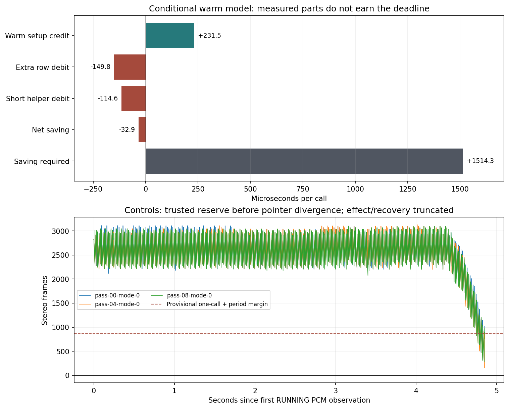

# A7 cost1 return: batching does not earn the Bio Blast budget

The physical return supplies repeatable A7 hot-path prices. It does **not**
qualify the window candidate. The measured fixed-work scenario offers only
0.231ms of setup credit, costs0.150ms in extra color materialization, and costs
about0.115ms in short-span shadow helpers: a modeled **0.033ms loss**. Even
granting zero bookkeeping leaves only0.082ms saving against the1.514ms late-call
deadline gap. Whole-candidate performance remains unmeasured; the installation
gate stays **NOT MET**. No executable was built, installed or re-armed on return.

## Preservation and physical coverage

Archive: `device-evidence/snes-mvp-return-20261010T184859Z`. Collection preserves
60 runtime/progress files,49 lab files and67 separate cost-suite files, with
source/copy/source hash checks. Fresh read-only FAT check is clean, serial
`11EB-1465`. Independent readback verifies all141 pre-test protected hashes,
every diagnostic payload, and the measurement dispatch. Stock, production
runner/core/adapter, private progress and reader artifacts are unchanged.
The marker is consumed; every test is unarmed and Code.bkp is absent. Card writes0.
The diagnostic dispatch remains in its owned wrapper; the unarmed next boot is
stock. This analysis does not restore or rewrite it.

The core SHA256 is
`ae2931386f40ce79f7a2c297d52e34dddadadb7c7d8da10a35f6039071db33ce`,
CRC`b5aa1b93`; owned runner SHA256
`0bdb238ffe20433fc20644b73189c60c7fbbc0f5c8aad3e3437acdcfbb712060`.
Linux4.19.128 armv7l, native backend, real audio/display workers, no synthetic
provider. All13 pass reports and complete, unwrapped PCM histories survive.

| Mode | Passes | Completed rendered calls per pass | Terminal call, zero based | Timing coverage |
|---|---:|---:|---:|---|
|0, counters/control|3|291|291|14 complete expensive calls277..290|
|1, sparse disjoint phases|3|285|285|Frame277 complete; frame285 is terminal|
|2, warm kernels|6|287|287|10 complete benchmark calls277..286, plus terminal287|
|3, dense frame320|1|291|291|No dense timing: stopped before320|

Every pass ends in `SYNC_OBSERVE errno=77`, SETUP/EBADFD, with no recorded XRUN.
There are no500-call completions or complete162-call effect/recovery captures.
Each pass has a new snapshot and PCM epoch. Thirteen independent failures do
not mean continuous recovery or accepted gameplay.

cpufreq/governor files are unavailable (ENOENT), pin not exposed/writable, and
every frequency pair is`-1,-1`. The sysfs online string`0` means **CPU0 is online**.
No sustained frequency is established. Microseconds below are direct kernel
thread-CPU/wall observations; no666MHz assumption or host-cycle conversion.
Caches are warmed16 iterations before each timing. Price coverage is limited
to early effect data: materialization shapes are4bpp rows5..7, sampled mask
rows0..3, clip/band rows4..10, and pending spans0 or38..48 (49 only in the
separately retained terminal set). Later shapes and
whole-candidate cache behavior are absent.

## Measured unit costs and what they price

All timer, loop and barrier cost stays included. Each path has60 individual
observations and180 batches of32:5,820 timed operations, from six physical runs.
The final call's11th set is retained separately; it is excluded from these prices,
ordinary cadence and the helper-count model because worker liveness at a terminal
stop is not guaranteed. The all-observation distributions also survive. Per-pass distributions,
CPU and wall distributions, shapes and tails are in the
[return analysis](../evidence/2026-10-10/snes-a7-cost1-return/return-analysis.json).

| Actual source path | CPU median,us/op | Batch-mean p95 | Batch-mean p99 | Individual CPU median / p99 |
|---|---:|---:|---:|---:|
|Renderer entry prefix|0.250|0.313|0.344|4 /5|
|Screen setup|0.125|0.156|0.250|3 /4|
|Background setup|0.188|0.250|0.250|4 /43|
|Object setup/clip list|0.406|0.469|0.469|4 /63|
|Tile renderer selection|0.094|0.125|0.125|4 /5|
|Color-row materialization payload|0.094|0.125|0.156|3 /4|
|Valid-bit test only|0.063|0.063|0.094|2 /3|
|Mask capture|0.188|0.219|0.250|2 /4|
|Deferral, short baseline spans|0.156|0.875|0.906|6 /9|
|Clip fetch|0.094|0.125|0.125|3 /3|
|Band-row comparison|0.063|0.094|0.094|2 /3|
|Mask reset|0.813|1.625|1.750|6 /24|
|Empty control|0.063|0.063|0.063|2 /3|

The main columns describe32-operation batch means, **not individual-call tail
latency**. Individual timings are substantially timer dominated. Empty controls
are reported, never subtracted. Object setup's individual wall p99 is1,813us;
mask reset's batch-mean wall p99 is18.625us versus CPU1.750us. Single-CPU worker
contention remains visible and cannot be converted into a reusable CPU price.

Materialization includes the real palette/NEON payload, forced validity clear
and update. It does not price the entire miss-versus-hit cache path. The valid-bit
test is not the full hit path and must not be subtracted from the materialization
price. Entry prefix, screen, BG, OBJ and selector blocks are distinct setup
paths, but their **removed-entry population** is not yet known. Their sum is not
automatically the candidate's `e`.

Deferral is an explicit scaling risk: the batch CPU median rises from0.125us
at pending span0, to0.719us at38, to0.875us at49. The implementation scans
`PreviousLine..CurrentLine` on each eligible edge write. Its cost scales with
the **sum of pending spans**, not just the number of writes. If the pending
span grows one row at a time, repeated scans grow as`L(L+1)/2`. Batching creates
longer pending spans; this capture cannot price them with the pooled0.353us
mean. More removed entries can come with more scanning and cache churn.

## The phase clocks materially perturb the failing interval

| Raw exclusive phase | Complete frame277 mean,ms (range over3 runs) | Terminal frame285 mean,ms |
|---|---:|---:|
|Entry/setup, including its clock boundaries|2.431 (2.408..2.454)|2.874|
|Pixel/tile plus unselected color/cache work|11.353 (11.304..11.405)|12.651|
|Selected row materialization|0.092 (0.090..0.095)|0.097|
|Window/clip bounds|0.956 (0.938..0.988)|1.133|
|Selected color/cache handling|0.442 (0.437..0.446)|0.431|

Frame277 has82 renderer entries,1,063 setup-region entries and4,295 total cost
clock calls. Frame285 has98 renderer entries and5,047 clock calls. The64-clock
controls cost about1.48us per clock in the sparse runs; benchmark-run mean
controls vary1.49..1.74us. Against the repeated controls with the same observed
cache split, profiled frame277 adds9.294ms CPU and9.837ms wall on average.
Benchmark calls277..284 add1.055ms CPU and1.186ms wall on average. All these
durations remain in the captures; none is a calibration to subtract.

The raw setup/renderer-entry quotient is29.4..29.9us at frame277, versus about
2.18us from the partial warm setup mix. **The29us quotient is not removable
production overhead.** The clocks nested through hundreds of setup/clip/cache
regions are part of that number. Multiplying it by106 removed entries would
manufacture a several-millisecond win. Sparse runs fail six calls earlier;
benchmark runs fail four earlier than controls. Observer cost is consequential,
even though live file logging was eliminated.

The pixel remainder still contains63/64 of color/cache requests, instrumentation
and other rendering work. Expanding selected-row timings by64 would also expand
timer cost. Frame320 was never reached. This return supports studying the
compositor/cache remainder, including the2010 NEON kernels, but cannot assign
11.35ms to pure compositing or quote a2010 port saving. Palette materialization
is already NEON and is comparatively cheap in the warm kernel measurements.

## Alignment: same rendering work, a different cache split

Every physical call matches the baseline census's renderer-entry count and
total color-row requests. Pass00 also matches every miss/reuse count exactly.
All12 later passes differ from that census from **frame0, before active phase
clocks or benchmarks**. Across the captured effect prefix they have19 more
materializations and19 fewer reuses per call. Thus this is a repeated-pass
context difference, not evidence that phase clocks changed guest rendering.

The direct-mapped color cache hashes the absolute allocated tile pointer;
tile buffers are allocated anew on load. Relative allocation/cache placement
is a plausible cause, not established by this capture: buffer addresses and
cache keys were not recorded. Do not claim identical cache state from a matching
guest snapshot. This is a small concrete example of why full cache interaction
and candidate weighting remain gate requirements. No assumed19-row correction
is applied to the timings.

## Quantitative scorecard and conditional predictions

The known work change is106.246914 fewer renderer entries and1,423.919753 extra
materialized rows per effect call. The installation equation remains:

`S = 106.246914e - 1423.919753r - b >= 1514.283us`.

For a **conditional warm scenario**, weight the five measured setup means by
the baseline path calls per renderer entry over the60 complete benchmark frames:
`1.000,1.7013,3.5686,1.6571,5.2257`. This gives`e_warm=2.1785us`.
Use the included materialization payload mean`r_payload=0.10521us`, without
subtracting the valid-bit control. Price the observed short-span helpers at
224 captures,119.4 deferral checks,159.8 fetches,159.8 comparisons and one reset
per call: `b_short=114.572us`. These are measured parts with hypothetical
population transfer, **not complete measured candidate e/r/b**.

| Conditional scenario | Setup credit | Extra-row cost | Helper cost | Net saving | Remaining late-call gap |
|---|---:|---:|---:|---:|---:|
|Mean kernels, bookkeeping granted free|231.462us|149.808us|0|81.654us|1,432.629us|
|Mean kernels, short-span helpers|231.462us|149.808us|114.572us|-32.918us|1,547.201us|
|Median kernels, short-span helpers|243.823us|133.492us|86.438us|23.893us|1,490.390us|

Even ignoring **all** added costs, the mean warm setup credit covers only15.3%
of the late-call floor. With the priced rows and no bookkeeping it covers5.4%.
With short helpers the mean scenario loses time. The complete candidate might
change cache locality and removed-entry mix; there is no physical net-saving
measurement here. The conclusion is that the **measured mechanism does not
support deficit closure**, not a proven upper bound on every possible candidate.

With the measured payload price, reaching the floor requires`e>=15.662us`
even with`b=0`, or`e>=16.741us` with the short-helper model. That is roughly
7.2..7.7 times the partial warm estimate. A new verdict needs measured savings
in missing fixed work/cache interactions large enough to pay that gap, a different
mechanism with at least1.5ms net credit, or demonstrated finite-effect buffering
with a complete valid reserve/recovery curve. Counts alone cannot change it.

Applying the warm mean scenario to Focus1's separate production proxy is a
conditional calculation, not this replay's measured production:

`P_new = 735.947520 / ((19125.135122 - S_us)/1000000)`.

It predicts38,414.5 frames/sec with short helpers (5,685.5 short of44,100), or
38,645.6 if bookkeeping is free (5,454.4 short). The former cadence is19.158ms;
the late core+admission account remains18.235ms against16.688ms. The2.437ms
PCM-cadence deficit is distinct from the1.514ms late-call floor. Short helpers
leave2.470ms of saving needed at that cadence. A several-percent entry-count
gain is not a several-percent production gain.

## Cycle quota and reserve explain the physical outcome

Native production is99.9994..100.0000% of the534.688402-frame nominal quota over
the returned calls. The existing master-clock contract predicts735.947520 sink
frames/call; changing that quota would change emulation, not recover CPU time.
In controls,14 completed effect-prefix calls277..290 take269.195..270.983ms
between kernel before-call timestamps. The quota predicts38,022..38,274 output
frames/sec and1,568..1,647 frames of demand beyond production in that short
prefix. This is a quota/cadence calculation, separately labeled from native
accepted-write observations. It predicts reserve erosion before the stop.

The full PCM histories retain priming through failure, without wrapping. Before
the first pointer mismatch, observed accepted-minus-hardware reserve reaches
only151..279 frames at its lowest samples. Trusted peak-to-trough drawdowns
are2,823..2,988 frames. In the three controls they are2,832,2,980 and2,823.
The declared provisional864-frame margin would give partial lower bounds
3,687..3,852 frames, with the largest above the3,712-frame device buffer. These
are **truncated-run bounds**, not a complete-effect buffer sizing prescription.
Recovery never occurs, and unobserved within-call minima can be lower.

All13 terminal reports show application pointer384 frames beyond accepted
writes. Twelve histories show an earlier128/256-frame difference while still
RUNNING; one exposes the discrepancy only at the stop. Stop remains SETUP/77,
with no recorded XRUN. Only pre-divergence SYNC observations certify pointer
reserve; WRITE_OK retains preceding pointer observations. No384-frame correction
is applied backward. The richer record strengthens the underproduction/reserve
sequence but still does not identify the vendor owner of the extra pointer
advance or prove starvation is the sole stop mechanism.



## Prediction before another build

Do not build/install the production window candidate on this scorecard. An
unchanged cost1 retry is expected to fail before frame320 again; deep region
clocks are expected to advance the failure, and warm batching alone is expected
to leave the production deficit largely intact. No physical acceptance is
claimed from these predictions.

If another diagnostic is chosen, first calculate its observer budget. Replace
thousands of nested clock boundaries with bounded single-region sampling and
report paired controls. Obtain later aligned states as separately qualified
snapshots so the early PCM stop cannot censor every later price; keep the real
workers/PCM live and record that these are separate epochs. Fingerprint cache
placement, collect the candidate-removed path mix, and measure actual longer
deferral spans/band populations. Capture full incremental cache costs rather
than repricing only a warm palette payload. These changes are a proposed
measurement plan, not a build or installation authorization on this return.

A future gate must predict at least1,514.283us net saving plus loop/headroom in
the late-call account, separately reach44,100 accepted frames/sec or show a
complete recoverable finite deficit, preserve full pixels/PCM/ordering, and
keep valid pointer accounting without a stop. Saving less than the declared
range, a growing unrepaid reserve deficit, changed output, pointer divergence
or PCM failure falsifies it. The current model misses the late-call gate by
about1.55ms; the unmeasured terms are not allowed to fill that margin by optimism.

Reproduce from the preserved archive:

```text
python build/analyze-a7-cost-return.py device-evidence/snes-mvp-return-20261010T184859Z/snes-cost1
```

The published13 cost CSVs and computed reserve/analysis files contain timings
and counters; no ROM, core dependency, private snapshot/SRAM or backup is
published. Publication preserves historical evidence hashes.
