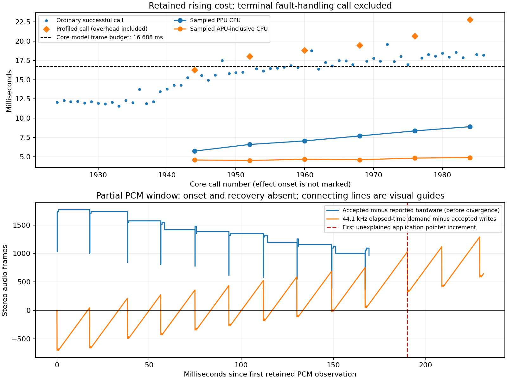

# Focus1 return: predict the timing contract before changing the implementation

The unchanged 1.19 core still fails Terra's Magitek Bio Blast. Focus1 now
captures the growing PPU cost during that failure. It establishes a specific
optimization target, not a measured cost per renderer entry or a qualified
replacement. No installation or rearm occurred. The window candidate fails
the required prediction gate until its A7 costs are measured.

## Return and preservation

Private archive `device-evidence/snes-mvp-return-20261010T164528Z` contains 60
runtime/progress files and 49 lab files, with source/copy/source hashes and a
second independent reread. All 58 prior files remain; all 12 private progress
files are unchanged, including nine CRC-valid snapshots and three SRAM
generations. Stock/current Vesper startup, normal init and 27 retained reader
files verify. Runner/core/wrapper match the Focus1 release. The consumed marker
identifies Focus1; all armed markers and Code.bkp are absent. Fresh read-only
CHKDSK confirms serial 11EB-1465 and clean FAT. Card writes: zero.

Session `502-10738153000` has 1,987 calls, 1,986 drawings, zero intentional holds
or duplicate drawings, one pause and one successful snapshot load. Native
ALSA ends with SYNC_OBSERVE errno77/SETUP and no recorded XRUN. The terminal
audio failure prevents the final drawing. B then exits the library; display
worker join, FreeVFB and board close complete. The wrapper records normal
exit255 from rc=-1, not a recorded signal crash, and final copies complete.
The unique failure report, final report and RAM checkpoint agree except for
their checkpoint/write accounting. The two PCM fault copies match exactly.

Only bounded text diagnostics/derived evidence are in
[the public return](../evidence/2026-10-10/snes-focus-1-return/).
ROMs, binary dependencies, SRAM, states and full card captures remain private.

## What emulated clocks predict

Use this exact core's model, not modern Snes9x's advertised 60.09881Hz:

| Quantity | Source-derived expectation |
|---|---:|
| Nominal master rate | 3,579,545 x 6 = 21,477,270 clocks/sec |
| Clocks per scanline | round(63.695us x master rate) = 1,368 |
| Scanlines per call, NTSC | 262 |
| Master clocks per nominal call | 358,416 |
| Native call rate / wall budget | 59.922743404/sec / 16.688154500ms |
| SPC clocks per nominal call | 358,416 x 15,664 / 328,125 = 17,110.028873 |
| DSP stereo frames per nominal call | SPC clocks / 32 = 534.688402 |
| Output stereo frames per nominal call | 534.688402 x 44,100/32,040 = 735.947520 |
| Cycle-derived native audio rate | 32,039.995931/sec |

The model's cycle-derived audio rate differs from the declared 32,040 by only
0.0000127%. This is not a 12% sample-rate discrepancy. The session delivers
1,062,349 native frames / 1,987 calls = 534.649723 per call, close to the
534.688402 expectation. Buffer remainders, snapshot/reset phase and the final
partial callback prevent treating this global average as an exact per-call
proof. Its narrow implication is that a large systematic native sample-quota
error is not evident. It does not prove every sample's fidelity.

`S9xAPUExecute` converts elapsed emulated master clocks to SPC clocks with a
carried remainder. SPC port reads/writes also run SPC execution to their
emulated timestamp. Rendering becoming slower on the host does not award
extra emulated time or extra audio to that frame. If approximately 736 output
frames arrive every 19.124ms while hardware consumes 44.1 frames/ms, the reserve
must decline. Register effects can therefore increase host work without
increasing the sound quota per nominal call.

Relevant pinned source: [clock constants](https://github.com/libretro/snes9x2005/blob/a79dfe9047e7fec58808aefe48ad2bf499c7af11/source/snes9x.h),
[SPC conversion, port execution and remainders](https://github.com/libretro/snes9x2005/blob/a79dfe9047e7fec58808aefe48ad2bf499c7af11/source/apu_blargg.c),
[frame execution](https://github.com/libretro/snes9x2005/blob/a79dfe9047e7fec58808aefe48ad2bf499c7af11/source/cpuexec.c).
The owned renderer changes preserve these constants. The report's fps matches
the calculation. These are emulator-model clocks, not independently verified
physical SNES clock accuracy.

Emulated master clocks are not host instructions or A7 cycles. A guest access
can consume six/eight/twelve master clocks while its host implementation has
different dispatch, memory and cache costs. The ROM's 103,538 statically mapped
instruction addresses are not a dynamic execution count. DT's 666MHz is not a
measured sustained clock; converting CPU time to actual hardware cycles with
that assumption would invent evidence.

The predictive host model must be:

`host CPU = sum(dynamic operation count x measured A7 unit cost) + bookkeeping`

`production cadence = host execution wall + admission + other loop work`

`audio reserve(t) = starting reserve + accepted audio(t) - consumed audio(t)`

A model must price renderer entry overhead separately from the pixel work
inside that entry, and account for workers/kernel service on this single CPU.
Emulated time predicts the quota and deadline; measured unit costs predict
whether this implementation can meet them. Counts alone cannot provide both.

## Measured phase attribution

All values below are milliseconds. Intervals are chronological windows in the
64 retained records; no ROM effect-onset or script-phase marker exists. Do not
label the early window definitively pre-effect. Call1987 is terminal fault
handling and excluded from successful means.

| Window | Ordinary count | retro_run wall | Main CPU | Audio callback wall | Video callback wall | Admission wall |
|---|---:|---:|---:|---:|---:|---:|
| Early retained,1924..1938 |15|12.165|11.320|0.472|1.172|4.278|
| Rising,1939..1967 |26|16.115|14.873|0.568|1.103|0.773|
| Late,1968..1986 |16|17.991|16.725|0.494|1.123|0.211|
| All63 successful retained, ordinary subset |57|15.602|14.458|0.522|1.127|1.538|

Admission precedes `retro_run`; its wall time is outside the displayed core
wall time. Early roughly4.3ms admission spends available headroom regulating
lead. Near failure it falls to0.211ms while core work rises. Removing admission
cannot recover the missing core capacity; even zero admission leaves the late
ordinary core mean over budget. Callback wall is inside `retro_run`, so it
must not be added again. Wall minus thread CPU indicates non-running time,
not a separately measured scheduler or driver cause.

| Sampled run | Main CPU | APU-inclusive CPU | PPU CPU | Audio callback CPU | Video callback CPU | retro_run wall | Admission wall |
|---|---:|---:|---:|---:|---:|---:|---:|
|1944|15.530|4.589|5.741|0.168|0.775|16.248|2.192|
|1952|16.819|4.529|6.601|0.170|0.848|18.020|0.175|
|1960|17.636|4.681|7.061|0.183|0.783|18.803|0.174|
|1968|18.330|4.617|7.706|0.169|0.847|19.436|0.180|
|1976|19.164|4.836|8.359|0.168|0.794|20.637|0.152|
|1984|19.957|4.898|8.904|0.172|0.881|22.771|0.180|

PPU grows3.163ms across these samples; APU-inclusive grows0.309ms and callback
CPU stays comparatively stable. PPU accounts for about71.4% of the4.427ms
growth in sampled main CPU. This supports a growing rendering bottleneck,
not an established price for any one entry, tile or color row. The clocks'
measured loop cost is1.209us; instrumentation stays included. There are no
same-state profiled/unprofiled pairs from which to infer exact overhead.

APU-inclusive regions can overlap callback CPU. They are displayed separately,
never summed as independent components. Unassigned main CPU includes
port-driven SPC execution and timing costs; it is not pure65C816 execution.
Audio/display worker CPU and kernel service remain outside these main-thread
phase samples. Call1987 takes29.651ms wall with12.936ms audio callback wall;
it includes failure handling/persistence and does not price normal mixing.

## Deficits: historical context and the actual return

The two requested prior numbers describe different measurements:

1. Previous1.19 ordinary final calls averaged18.287ms wall against16.688ms:
   1.599ms over per call. This is the previous expensive failing interval,
   **not an established ordinary-play or pre-effect baseline**.
2. Previous1.19 matched PCM anchors produced38,763.739/sec against44,100:
   12.100% shortage, requiring13.766% more throughput to break even.

Focus1 late ordinary successful calls average17.991ms core wall plus0.211ms
admission: at least18.202ms before other loop work. A candidate must save at
least1.514ms per representative late call merely to reach16.688ms under that
accounting, then provide headroom. The PCM window independently accepts8,831
frames over229.492ms:38,480.644/sec, a12.742% shortage requiring14.603% more
throughput. Its13 large-batch anchors are a workload-specific production proxy
and include the diagnostic workload, not a controlled1.19/Focus1 comparison.

Approximately735.948 output frames over the measured19.124ms mean batch cadence
predict about38.48k/sec, consistent with the measured write rate. This connects
the emulator's clock quota to the physical production deficit. Global active
rate59.870calls/sec averages ordinary gameplay and pacing with the final
failure; it cannot establish effect survival.

## Cumulative reserve: what survives and what does not

The PCM ring retains only96 operations, spanning248.281ms. Reliable pointer
accounting ends at169.394ms relative to its first observation. At190.213ms
the first unexplained128-frame application-pointer increment appears; two more
128-frame increments follow. This differs from the previous trace's grouped
128+256 observations. Final SETUP/EBADFD remains unexplained: no recorded XRUN
identifies the stop mechanism.

For every retained SYNC observation, [reserve-curve.csv](../evidence/2026-10-10/snes-focus-1-return/reserve-curve.csv)
records both elapsed-time demand `44,100 x elapsed` and reported hardware
advance, against accepted write counts. WRITE_OK contains the preceding
pointer observation, so pointer reserve is calculated only at SYNC points.
Before divergence, application pointer equals accepted count. After divergence,
reported queued sound includes an unexplained offset and is not certified
playable reserve. No fixed384-frame correction is applied to earlier samples.

From the first retained observation, the trusted peak prefix deficit is672
frames. The largest observed peak-to-trough reserve loss is1,407 frames;
minimum observed trusted reserve is362. Nominal elapsed-time demand shows a
1,992.978-frame drawdown across the running retained interval, but this is a
rate-based model after divergence, not verified sound availability. Hardware
updates are quantized, observations are sparse and unobserved troughs can be
lower.

For a known effect start and complete record, with
`D(t)=consumed(t)-produced(t)`, minimum initial reserve is
`max(0,max(D(t))) + margin`. When refill is capped and early surplus cannot be
kept, use maximum drawdown `max(D(t)-min(D(u),u<=t)) + margin` as well. Both
depend on within-frame publication timing, not just total samples per frame.

A declared provisional margin is one nominal call rounded up736 plus one
128-frame period =864 frames. The observed partial drawdown plus that margin
is2,271 frames (51.497ms). **This is not a complete-effect sizing recommendation**:
onset, earlier loss, later cost and recovery are absent, and the stream fails
before a complete effect. The nominal2,823-frame prime (64.014ms) is an initial
target/lead cap, not a maintained minimum. The observed window starts with
only1,034 accepted-minus-hardware frames before the next write.

The readable ROM script has56+33 update loops with scheduler yields; this is
not evidence that the complete physical attack lasts exactly89 host calls.
The separate replay's162 expensive frames likewise are not timestamps or a
physical duration for this encounter. Extrapolating the final rate across that
number would fabricate the missing complete-effect curve. A finite dip could
be buffered if recovery repays it; this return cannot qualify that possibility.



## Window candidate scorecard: all five installation conditions

The separate replay removes106.246914 PPU entries per effect frame and adds
1,423.919753 color-row materializations. Define `e` as removable overhead per
entry, `r` as incremental cost per extra materialization and `b` as added
bookkeeping/cache cost, all measured on A7 in microseconds for the aligned
state. Then predicted saving `S=106.246914e-1423.919753r-b`.

| Required condition | Current evidence / result |
|---|---|
|1. Quantified A7 saving|**Unmeasured.** Inclusive PPU timing cannot be divided by entries: it includes pixel work retained by the candidate. No aligned per-unit measurements.|
|2. Added costs|Extra rows known (+34.58%); cost per row, row-tag/band handling and cache/memory effects **unmeasured**.|
|3. Break-even inequality|`106.246914e > 1423.919753r + b`, or `e > 13.401987r + b/106.246914`. Reaching current late-call deadline additionally needs `S >= 1514.283us` before other loop overhead and safety headroom.|
|4. Deficit closed / remaining|**Unmeasured.** The prior13.766% requirement and current14.603% requirement cannot be claimed closed. For aligned production cadence `T`, saving `S` predicts `P_new=q/(T-S)`; recompute `44,100-P_new` and the complete cumulative reserve, not a work-count percentage.|
|5. Falsifiable physical prediction|Before installation, supply bounded predicted savings/cadence and reserve curve. Require accepted production to repay the complete effect deficit, valid pointer accounting, no stop, and unchanged full rendering/PCM. A measured net time loss, growth in cumulative deficit beyond budget, missing samples, pointer divergence or PCM stop rejects the prediction. Numeric pass thresholds are not yet available.|

Gate: **NOT MET.** Correctness checks remain passed; performance prediction
is not supplied by those checks. `flush_before_2129` stays a pre-deferral
counter and is never priced as an actual removed flush.

## What this means for the next engineering decision

The mechanism to optimize is now sharper: a fixed emulated audio quota meets
rising host PPU work, admission headroom disappears, accepted reserve erodes,
then vendor pointer/state behavior departs from accepted-write accounting.
This sequence supports rendering-driven underproduction as a trigger. It does
not identify the kernel owner of the extra pointer increments or prove that
starvation alone causes SETUP.

Study2010 compositor kernels where this PPU actually spends time; measure
whole-entry overhead separately from tile/color work before choosing batching.
Direct sample delivery is another lead, but frontend audio callback CPU is
only about0.17ms in these samples. Eliminating that entire measured portion
alone would not close a1.514ms late-call gap. Internal core staging lies inside
other regions and is not separately priced, so this does not dismiss a broader
audio-path improvement. No porting or installation is authorized by a static
NEON count or a newer core label.

Missing measurements are specific: aligned dynamic operation counts and A7
unit costs; added candidate costs; complete onset-to-recovery output/consumption
timestamps; disjoint platform service budget; vendor stop/pointer mechanism.
Collecting them must preserve emulated ordering and PCM contents, label
observer effects and avoid presenting another diagnostic as a fix.

Reproduce offline, from the preserved archive:

```text
python build/analyze-snes-focus.py device-evidence/snes-mvp-return-20261010T164528Z/snes-mvp/saves/last-session.txt
python build/analyze-snes-effect-budget.py device-evidence/snes-mvp-return-20261010T164528Z
python build/publish-snes-focus-return.py device-evidence/snes-mvp-return-20261010T164528Z
python build/plot-snes-effect-budget.py
```

The standing installation contract is all five written conditions above,
separate production qualification and healthy-card guards. QEMU timings remain
outside A7 performance evidence. Failed1.19 remains unarmed.
